# ジョルダン 乗換案内
A Line bot based on a finite state machine

More details in the [Slides](https://hackmd.io/@TTW/ToC-2019-Project#) and [FAQ](https://hackmd.io/s/B1Xw7E8kN)

## Setup

### Prerequisite
* Python 3.6
* Pipenv
* Facebook Page and App
* HTTPS Server

#### Install Dependency
```sh
pip3 install pipenv

pipenv --three

pipenv install

pipenv shell
```

* pygraphviz (For visualizing Finite State Machine)
    * [Setup pygraphviz on Ubuntu](http://www.jianshu.com/p/a3da7ecc5303)
	* [Note: macOS Install error](https://github.com/pygraphviz/pygraphviz/issues/100)


#### Secret Data
You should generate a `.env` file to set Environment Variables refer to our `.env`.
`LINE_CHANNEL_SECRET` and `LINE_CHANNEL_ACCESS_TOKEN` **MUST** be set to proper values.
Otherwise, you might not be able to run your code.

#### Run Locally
You can either setup https server or using `ngrok` as a proxy.

## Finite State Machine
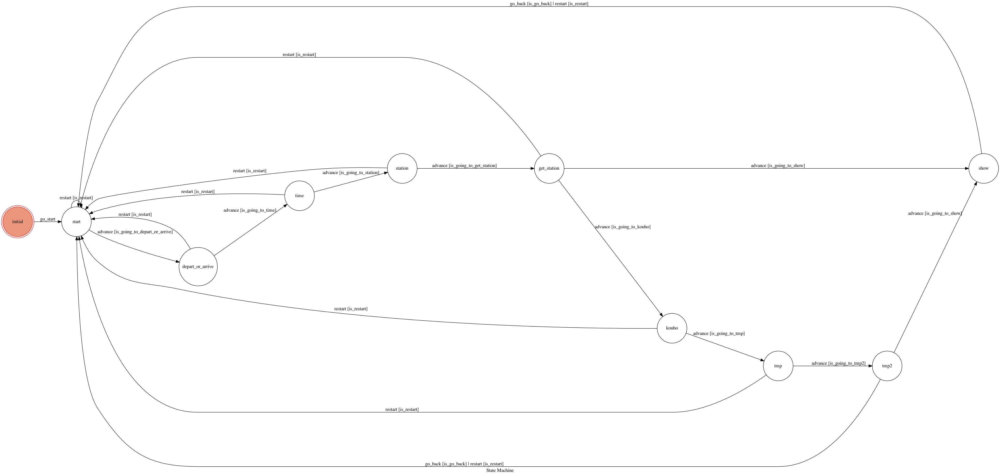

## Usage
一開始的state是 `initial`，
打任意文字之後，會從 `initial` 到 `start`
* `start` : 選擇服務項目。
	* 顯示畫面: 
		<div align="left">
			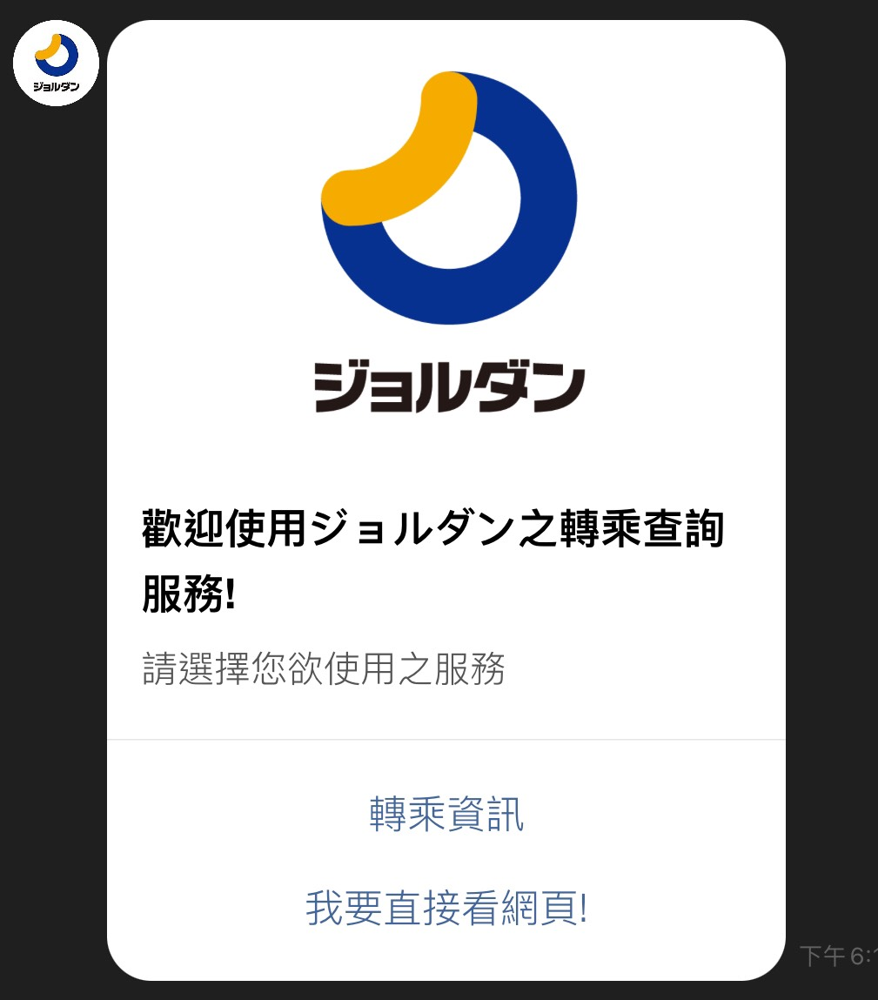
		</div>
	* 點擊: "轉乘資訊"，進到下一個state `depart_arrive`。
		<div align="left">
			
		</div>
	* 點擊: "我要直接看網頁!"，開啟此程式主要應用web crawler的網頁。

* `depart_arrive` : 選擇查詢出發or抵達時間
	* 顯示畫面: 
		<div align="left">
			
		</div>
	* 點擊: "出發"，進到下一個state `time`。
		<div align="left">
			
		</div>
	* 點擊: "抵達"，進到下一個state `time`。
		<div align="left">
			
		</div>

* `time` : 輸入欲查詢時間
	* 顯示畫面:
		<div align="left">
			
		</div>
	* 點擊: "請選擇日期與時間"。
		<div align="left">
			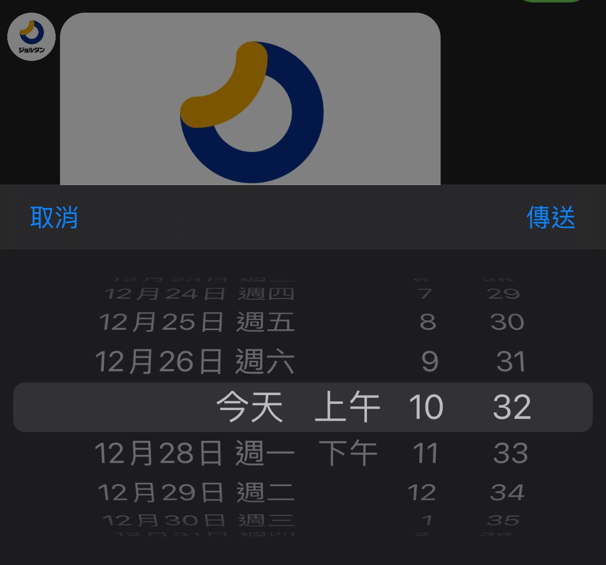
		</div>
	* 點擊: "傳送"，進到下一個state `station`。
		<div align="left">
			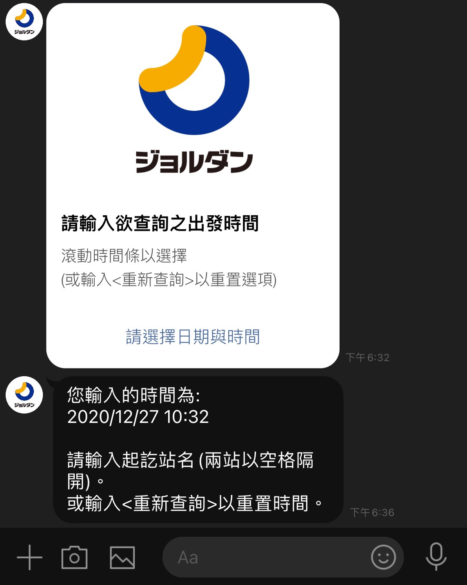
		</div>

* `station` : 輸入起訖站名
	* 顯示畫面:
		<div align="left">
			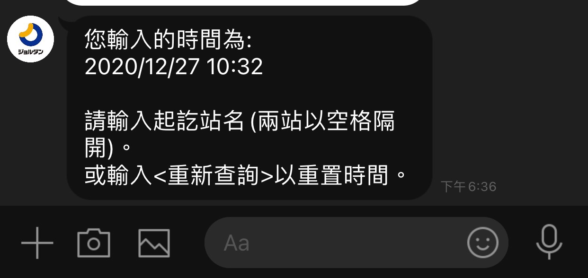
		</div>
	* 輸入: 札幌 菊川 (敘述完整之兩站名)，
	經由state `get_station` 爬蟲判斷其完整後，進到下個state `show`。
		<div align="left">
			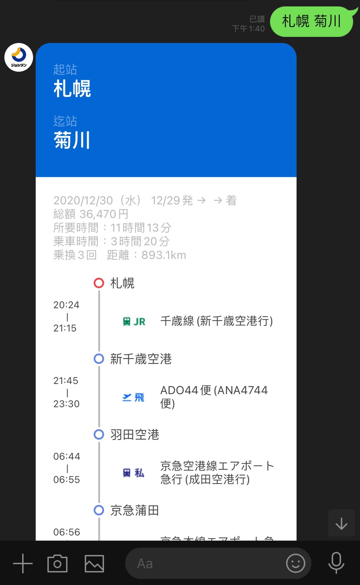
		</div>
	* 輸入: 弘明寺 東雲 (敘述不完整之兩站名)，
	經由state `get_station` 爬蟲判斷其不完整後，進到下個state `kouho`。
		<div align="left">
			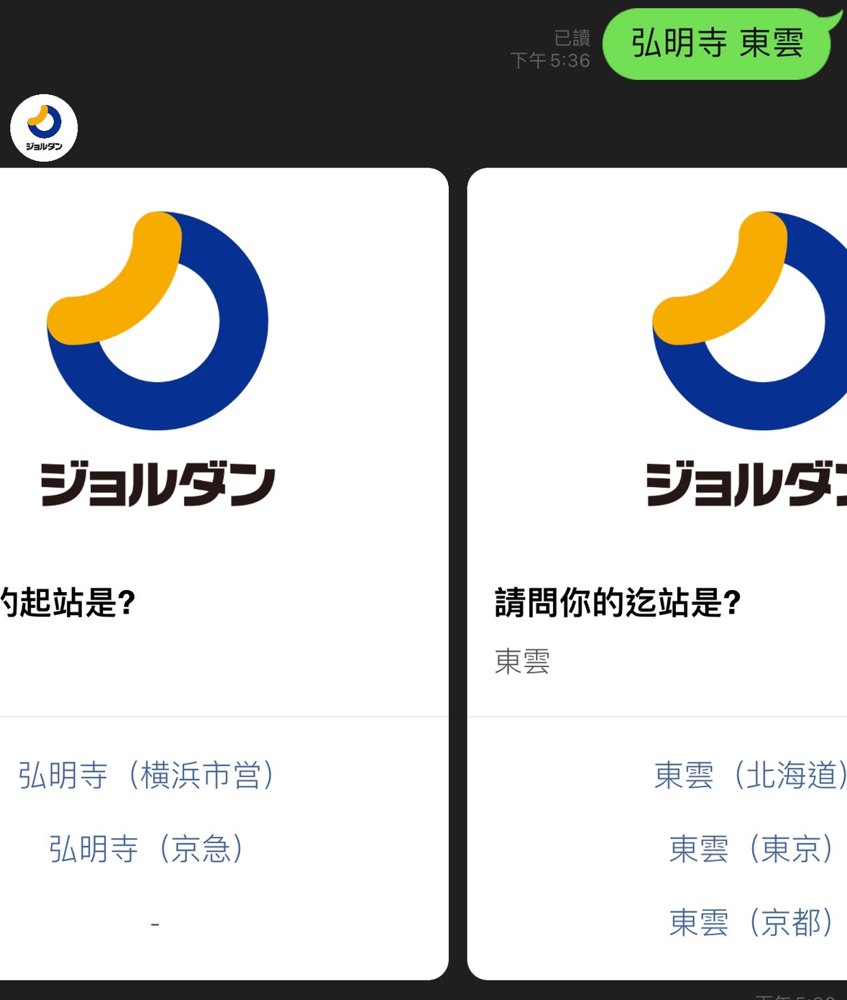
		</div>

* `show` : 爬蟲並顯示轉乘資訊
	* 顯示畫面:
		<div align="left">
			
		</div>
		<div align="left">
			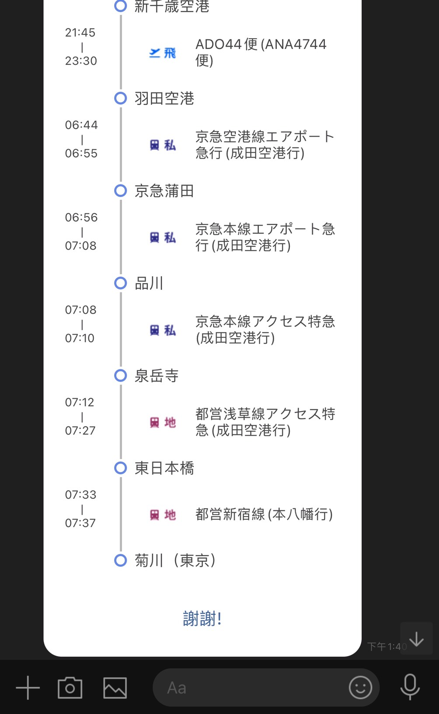
		</div>
	* 點擊: "謝謝"，回到原本的state `start`。
		<div align="left">
			
		</div>

* `kouho` :列出建議起迄站，供用戶選擇
	* 顯示畫面:
		<div align="left">
			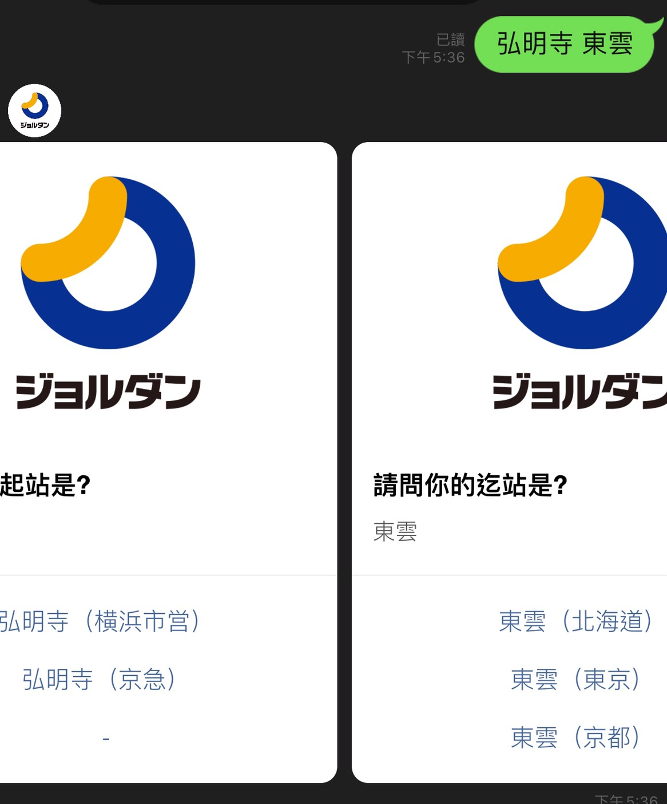
		</div>
	* 選擇起訖站後，經 `tmp` `tmp2` 兩states，爬蟲並顯示轉乘資訊。
		<div align="left">
			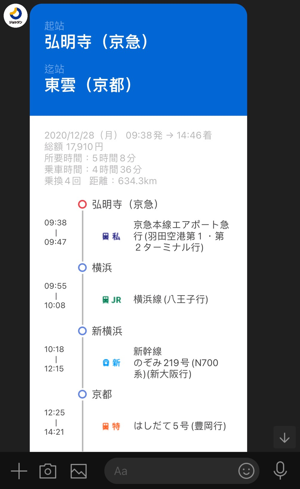
		</div>
		<div align="left">
			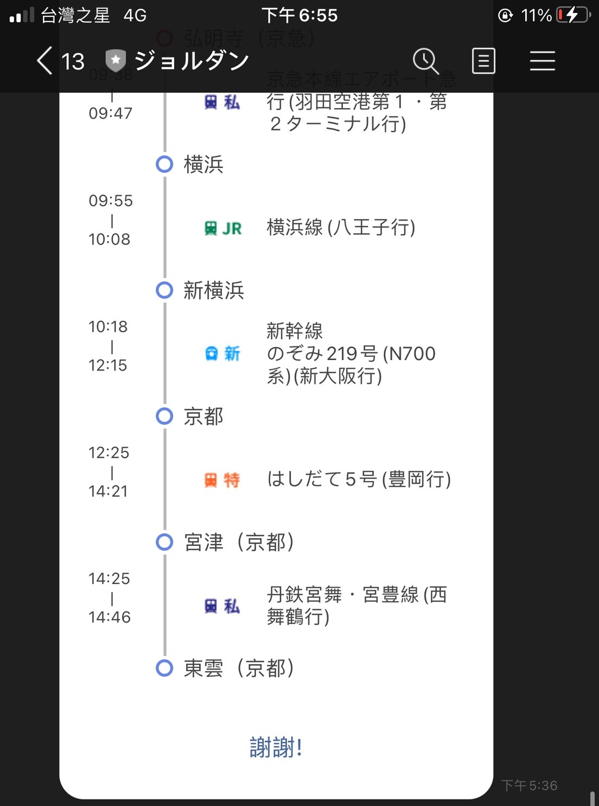
		</div>
	* 點擊: "謝謝"，回到原本的state `start`。
		<div align="left">
			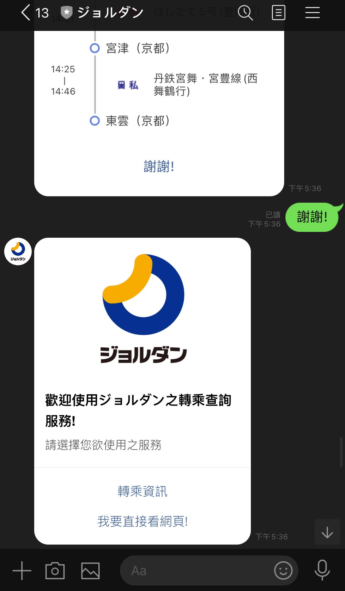
		</div>

```sh
  所有state皆可藉由輸入"重新查詢"，回到state `start`。
```


## Deploy
Setting to deploy webhooks on Heroku.

### Heroku CLI installation

* [macOS, Windows](https://devcenter.heroku.com/articles/heroku-cli)

or you can use Homebrew (MAC)
```sh
brew tap heroku/brew && brew install heroku
```

or you can use Snap (Ubuntu 16+)
```sh
sudo snap install --classic heroku
```

### Connect to Heroku

1. Register Heroku: https://signup.heroku.com

2. Create Heroku project from website

3. CLI Login

	`heroku login`

### Upload project to Heroku

1. Add local project to Heroku project

	heroku git:remote -a {HEROKU_APP_NAME}

2. Upload project

	```
	git add .
	git commit -m "Add code"
	git push -f heroku master
	```

3. Set Environment - Line Messaging API Secret Keys

	```
	heroku config:set LINE_CHANNEL_SECRET=your_line_channel_secret
	heroku config:set LINE_CHANNEL_ACCESS_TOKEN=your_line_channel_access_token
	```

4. Your Project is now running on Heroku!

	url: `{HEROKU_APP_NAME}.herokuapp.com/callback`

	debug command: `heroku logs --tail --app {HEROKU_APP_NAME}`

5. If fail with `pygraphviz` install errors

	run commands below can solve the problems
	```
	heroku buildpacks:set heroku/python
	heroku buildpacks:add --index 1 heroku-community/apt
	```

	refference: https://hackmd.io/@ccw/B1Xw7E8kN?type=view#Q2-如何在-Heroku-使用-pygraphviz

## Reference
[Pipenv](https://medium.com/@chihsuan/pipenv-更簡單-更快速的-python-套件管理工具-135a47e504f4) ❤️ [@chihsuan](https://github.com/chihsuan)

[TOC-Project-2019](https://github.com/winonecheng/TOC-Project-2019) ❤️ [@winonecheng](https://github.com/winonecheng)

Flask Architecture ❤️ [@Sirius207](https://github.com/Sirius207)

[Line line-bot-sdk-python](https://github.com/line/line-bot-sdk-python/tree/master/examples/flask-echo)
